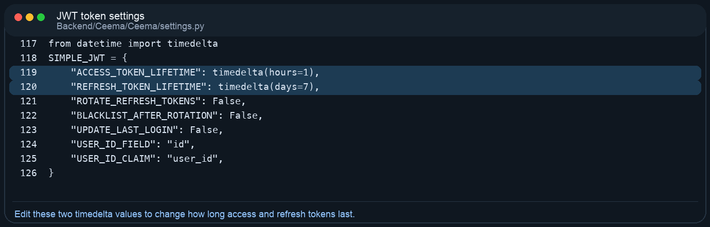
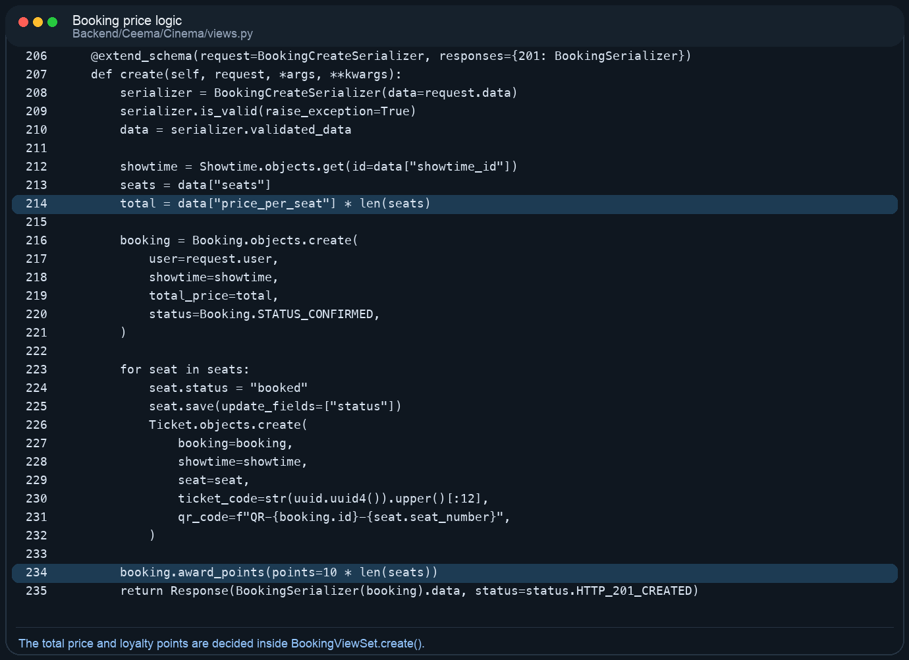
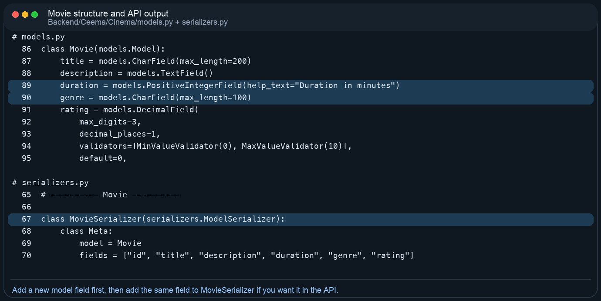
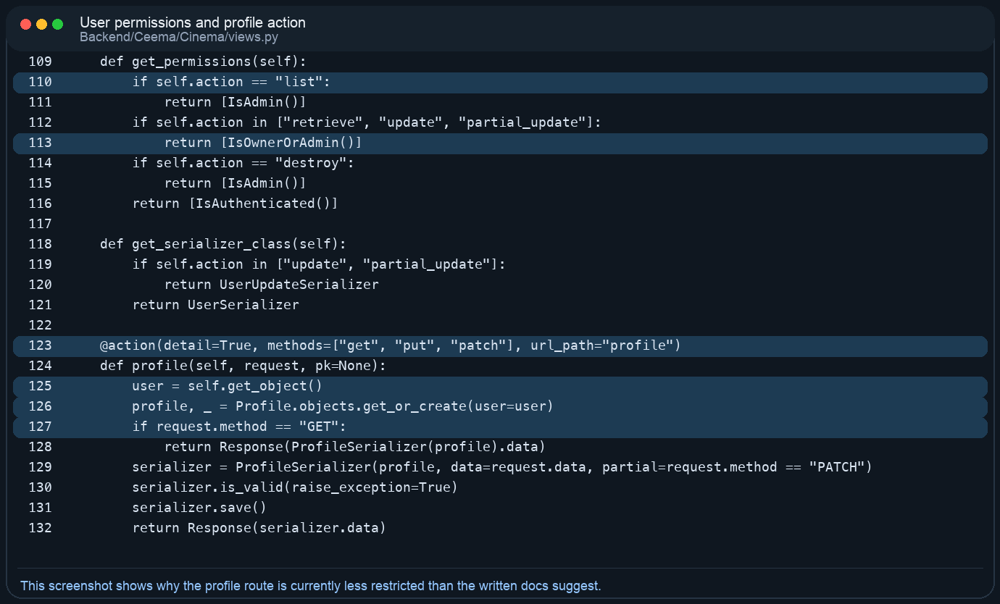

# CEEMA Project Guide For Non-Technical Editors

Reviewed on 2026-04-19 after checking the repository, `DOCUMENTATION.md`, the Django code, the fixture data, the OpenAPI snapshot, and the current tests.

## 1. Project Summary

CEEMA is a Django REST API backend for a cinema platform. It handles user accounts, JWT login, movies, showtimes, seat booking, tickets, reviews, social posts, courses, badges, rewards, recommendations, and admin reports. There is no frontend application in this repository; the main deliverable is the API and its admin/data tools.

- Primary runtime code lives in `Backend/Ceema/`.
- The business app is `Backend/Ceema/Cinema/`.
- The API is documented live at `/api/docs/` and as raw schema at `/api/schema/`.
- The project can use PostgreSQL when environment variables are set, or SQLite when they are not.
- The sample fixture contains 66 records for demo/testing data.
- The Django app defines 18 CEEMA models.
- The OpenAPI snapshot currently exposes 36 paths.
- The current test suite contains 5 tests; 4 pass and 1 fails because the homepage route `/` is not implemented.

| Quick Fact | Value |
|---|---|
| Project type | Django REST Framework backend |
| Authentication | JWT access + refresh tokens |
| Main app folder | Backend/Ceema/Cinema |
| Config folder | Backend/Ceema/Ceema |
| Admin panel | http://localhost:8000/admin/ |
| Live API docs | http://localhost:8000/api/docs/ |
| Schema endpoint | http://localhost:8000/api/schema/ |
| Sample data file | Backend/Ceema/Cinema/fixtures/sample_data.json |

## 2. What Is In The Repository

| Path | What it is | Should a non-coder edit it? |
|---|---|---|
| DOCUMENTATION.md | Existing long-form project documentation. | Yes, if you are improving written docs. |
| README.md | Root readme file. It is currently placeholder text in UTF-16 and is not useful as a guide. | Yes, but only if you want to replace the placeholder. |
| Backend/Ceema/ | Real Django project root. Most technical work happens here. | Yes, this is the main working area. |
| Backend/Ceema/Cinema/ | App models, serializers, views, permissions, fixtures, tests, admin registration. | Yes, but carefully. |
| Backend/Ceema/Ceema/ | Project settings, top-level URLs, ASGI/WSGI config. | Yes, for settings and routing changes. |
| Backend/Ceema/setup.sh | Mac/Linux PostgreSQL setup helper. | Yes, if Mac/Linux setup steps are wrong. |
| Backend/Ceema/setup.ps1 | Windows PostgreSQL setup helper. | Yes, if Windows setup steps are wrong. |
| Backend/Ceema/run.ps1 | Small Windows shortcut that loads `.env` and starts the server. | Only if startup steps change. |
| docs/api/ | OpenAPI snapshots (`openapi.json`, `openapi.yaml`). | Yes, regenerate after API changes. |
| docs/superpowers/specs/ | Early design notes/specifications. Helpful context but not runtime code. | Usually no. |
| Backend/Ceema/venv/ | Local virtual environment. Generated machine-specific dependencies. | No. |

## 3. How The Backend Is Organized

The fastest way to understand the code is this: data structure starts in `models.py`, API JSON shape lives in `serializers.py`, business behavior lives in `views.py`, access rules live in `permissions.py`, and routes live in `urls.py`.

| File | Main purpose | Typical reason to edit it |
|---|---|---|
| Backend/Ceema/Cinema/models.py | Defines database tables and relationships. | Add or change a field, constraint, or relationship. |
| Backend/Ceema/Cinema/serializers.py | Defines JSON input/output. | Expose a field, validate input, or change response shape. |
| Backend/Ceema/Cinema/views.py | Implements feature behavior. | Change booking logic, profile behavior, reviews flow, or business rules. |
| Backend/Ceema/Cinema/permissions.py | Custom permission rules. | Change who can access an endpoint. |
| Backend/Ceema/Cinema/urls.py | Registers API routes. | Add a new route or expose a new viewset. |
| Backend/Ceema/Ceema/settings.py | Database, JWT, static files, Swagger settings. | Change token lifetime or database config. |
| Backend/Ceema/Ceema/urls.py | Top-level site routes. | Add a homepage route or a new top-level page. |
| Backend/Ceema/Cinema/admin.py | Registers models in Django admin. | Expose a model in `/admin/`. |
| Backend/Ceema/Cinema/tests.py | Automated tests. | Add coverage or fix broken expectations. |

## 4. Best Editing Options For Non-Technical Users

| Goal | Safest method | Skill level | Notes |
|---|---|---|---|
| Change movies, courses, badges, rewards, posts, or bookings data | Use `/admin/` after creating a Django superuser. | Low | No code changes needed. |
| Change demo/sample content | Edit `Backend/Ceema/Cinema/fixtures/sample_data.json`. | Low to Medium | Reload the fixture afterward. |
| Change written explanations | Edit `DOCUMENTATION.md` or this guide. | Low | No server logic changes. |
| Change API field names or output | Edit `serializers.py`. | Medium | This changes what frontend apps receive. |
| Change who can access an endpoint | Edit `permissions.py` and the `get_permissions()` logic in `views.py`. | Medium | Easy to create security bugs here. |
| Add a new database field | Edit `models.py`, run migrations, then update serializers/views/docs/tests. | High | This is the most common place for breakage. |

- Low-risk changes: text, fixture data, admin panel data entry, docs updates.
- Medium-risk changes: serializers, permission checks, setup instructions, Swagger metadata.
- High-risk changes: models, migrations, booking flow, authentication, admin-role logic.

## 5. Running The Project

### Simplest demo setup using SQLite

This is the easiest route if you mainly want to open the project, run it, and test the API. The code already falls back to SQLite when PostgreSQL variables are not set.

```text
Mac/Linux
cd Backend/Ceema
python3 -m venv venv
source venv/bin/activate
pip install -r requirements.txt
python manage.py migrate
python manage.py loaddata Cinema/fixtures/sample_data.json
python manage.py runserver
```

```text
Windows PowerShell
cd Backend\Ceema
py -m venv venv
.\venv\Scripts\Activate.ps1
pip install -r requirements.txt
python manage.py migrate
python manage.py loaddata Cinema/fixtures/sample_data.json
python manage.py runserver
```

### PostgreSQL setup scripts

- `setup.sh` creates the virtual environment, installs dependencies, collects PostgreSQL settings, writes `.env`, and runs migrations.
- `setup.ps1` does the same and also starts the development server at the end.
- Important correction: the current `DOCUMENTATION.md` says the Mac script starts the server automatically, but the actual `setup.sh` only prepares the environment and prints the next commands.

### Useful URLs after the server starts

- Swagger UI: `http://localhost:8000/api/docs/`
- Raw schema: `http://localhost:8000/api/schema/`
- Django admin: `http://localhost:8000/admin/`

The fixture file contains 66 objects. It includes 7 CEEMA users, 3 movies, 4 showtimes, 10 seats, 3 bookings, posts/comments/likes, badges, rewards, courses, recommendations, and reports. It does not include any `PaymentTransaction` rows.

All sample CEEMA API users use the password `ceema123`.

## 6. Data Model Guide

| Model | What it stores | Typical edit impact |
|---|---|---|
| User | Main CEEMA API user record with name, email, hashed password, points, and role. | Affects login, permissions, bookings, posts, reviews, and recommendations. |
| Admin | Subclass of User used mainly for report ownership. | Relevant when promoting a user to admin. |
| Profile | Extra user profile data such as bio and followers count. | Used by `/api/users/{id}/profile/`. |
| Movie | Movie catalog entries. | Drives movies, showtimes, reviews, and recommendations. |
| Showtime | Date/time entries for a movie screening. | Needed before seats and bookings can exist. |
| Seat | Individual seats for a specific showtime. | Booking logic reads and updates seat status. |
| Booking | A user reservation for a showtime. | Central business record for tickets and loyalty points. |
| Ticket | Generated seat ticket tied to a booking and showtime. | Created automatically during booking. |
| PaymentTransaction | Stored payment metadata for a booking. | Model exists, but there is no public payment API yet. |
| Review | Star rating and comment for a movie. | Linked to user, movie, and optionally course. |
| Post | Social feed post. | Can be liked and commented on. |
| Comment | Comment on a post. | Used in social features. |
| PostLike | Like relationship between a user and a post. | Unique per user+post. |
| Badge | Achievement badge catalog. | Many-to-many with users. |
| Reward | Redeemable reward catalog. | Many-to-many with users. |
| Course | Cinema learning course. | Users can enroll/unenroll. |
| Recommendation | Recommended movie for a user. | Read-only endpoint filtered to the current user. |
| Report | Admin-generated report record. | Only admins can create/manage through API. |

## 7. API Map In Plain English

| API area | Main routes | Actual access in code | Where to edit it |
|---|---|---|---|
| Authentication | `/api/auth/register/`, `/login/`, `/logout/`, `/refresh/` | Register/login are public. Logout needs JWT. | Cinema/views.py, Cinema/serializers.py |
| Users | `/api/users/`, `/api/users/{id}/`, `/api/users/{id}/profile/` | User list is admin-only. Detail/update is owner-or-admin. Profile action currently only checks that the caller is authenticated. | Cinema/views.py, Cinema/permissions.py |
| Movies | `/api/movies/`, `/search/`, `/api/movies/{id}/reviews/` | List/detail/search are public. Create/update/delete are admin-only. Reviews action is currently admin-only in practice because of `get_permissions()`. | Cinema/views.py, Cinema/serializers.py |
| Bookings & tickets | `/api/bookings/`, `/cancel/`, `/tickets/` | JWT required. Normal users only see their own bookings via queryset filtering; admins see all. | Cinema/views.py, Cinema/serializers.py |
| Social | `/api/posts/`, `/like/`, `/comments/` | JWT required. Edit/delete is owner-or-admin. | Cinema/views.py, Cinema/permissions.py |
| Courses | `/api/courses/`, `/enroll/`, `/unenroll/` | Read is authenticated; writes are admin-only. | Cinema/views.py |
| Badges, rewards, recommendations | `/api/badges/`, `/api/rewards/`, `/api/recommendations/` | Authenticated, read-only. | Cinema/views.py, Cinema/serializers.py |
| Admin tools | `/api/admin/reports/`, `/api/admin/users/` | Admin-only. | Cinema/views.py, Cinema/permissions.py |

- The code exposes more CRUD routes than the long-form docs emphasize because many resources use `ModelViewSet`.
- If you want docs and behavior to match perfectly, either restrict the code further or expand the docs so all exposed routes are described clearly.

## 8. Where To Edit Common Changes

| If you want to change... | Edit these file(s) | What to do |
|---|---|---|
| Movie title, description, duration, genre, rating | `Cinema/models.py` and usually `/admin/` or fixture data | For data only, edit records in admin or the fixture. For structure, edit the model and serializer. |
| What fields the movie API returns | `Cinema/serializers.py` -> `MovieSerializer` | Add or remove field names in the serializer. |
| How booking price is calculated | `Cinema/views.py` -> `BookingViewSet.create` | Change `price_per_seat` handling and total price calculation. |
| Whether a user can access a route | `Cinema/permissions.py` and `get_permissions()` in `Cinema/views.py` | Update permission classes and route-specific permission logic. |
| JWT expiry time | `Ceema/settings.py` -> `SIMPLE_JWT` | Change `ACCESS_TOKEN_LIFETIME` and/or `REFRESH_TOKEN_LIFETIME`. |
| Database engine or DB connection | `Ceema/settings.py` and `.env` | Set PostgreSQL variables or let the app fall back to SQLite. |
| Sample/demo users and movies | `Cinema/fixtures/sample_data.json` | Edit the JSON, then reload with `python manage.py loaddata ...`. |
| Homepage or landing page | `Ceema/urls.py` and a new view/template | The test suite expects `/` to exist, but it currently does not. |

Special case: permissions mostly check `request.user.role == "admin"`, but report creation also expects a matching `Admin` subclass row. That means changing only the role string may not be enough for every admin-only workflow.

## 9. Visual Edit Walkthroughs

This section adds screenshot-style examples from the real project files. Each example shows where to click or open, what part of the code matters, and what a typical edit looks like.

### Example 1: Change how long JWT tokens last

Open `Backend/Ceema/Ceema/settings.py`. The `SIMPLE_JWT` dictionary controls token lifetime.



*Real code area for changing access and refresh token expiry times.*

```text
Before
"ACCESS_TOKEN_LIFETIME": timedelta(hours=1),
"REFRESH_TOKEN_LIFETIME": timedelta(days=7),

Example change
"ACCESS_TOKEN_LIFETIME": timedelta(hours=2),
"REFRESH_TOKEN_LIFETIME": timedelta(days=14),
```

After editing this file, restart the server so the new token settings are used.

### Example 2: Change the booking price formula

Open `Backend/Ceema/Cinema/views.py` and find `BookingViewSet.create()`. This is the method that calculates the booking total and awards loyalty points.



*Real booking logic used when a user reserves seats.*

```text
Current idea
total = data["price_per_seat"] * len(seats)

Example change with a flat service fee
service_fee = 10
total = (data["price_per_seat"] * len(seats)) + service_fee
```

If you change money logic here, test it in Swagger by creating a booking and checking the returned `total_price`.

### Example 3: Add a new movie field and make it appear in the API

Adding a field normally needs at least two code edits: one in `models.py` and one in `serializers.py`.



*The model controls the database field. The serializer controls whether the field appears in API responses.*

```text
Model example
poster_url = models.URLField(blank=True)

Serializer example
fields = ["id", "title", "description", "duration", "genre", "rating", "poster_url"]
```

After adding a new model field, you must create and run a migration. Otherwise Django will know about the field in code but not in the database.

```text
Migration commands
cd Backend/Ceema
./venv/bin/python manage.py makemigrations
./venv/bin/python manage.py migrate
```

### Example 4: Understand or tighten profile permissions

Open `Backend/Ceema/Cinema/views.py` and review the `UserViewSet`. The list/retrieve/update routes have explicit permission checks, but the custom `profile()` action currently does not add owner-only protection.



*This is why any logged-in user can currently reach another user’s profile route.*

```text
Safer idea inside profile() before saving
if request.user.role != "admin" and user != request.user:
    return Response({"detail": "You do not have permission."}, status=403)
```

This kind of change affects security, so it should always be tested with both a normal user and an admin account.

## 10. Important Gaps Or Mismatches Found During Review

| Topic | What the current docs suggest | What the code actually does |
|---|---|---|
| Model count | Some sections say the app has 17 models. | The app defines 18 models: it includes both `PaymentTransaction` and `Report`. |
| Mac setup flow | The Mac setup narrative says `setup.sh` starts the server. | The script installs dependencies, writes `.env`, and runs migrations, but does not start the server. |
| Movie reviews route | Docs describe review listing/posting as authenticated user behavior. | Because `MovieViewSet.get_permissions()` does not allow the `reviews` action explicitly, that route is admin-only at the moment. |
| Profile route permissions | Docs describe profile editing as owner-or-admin only. | The custom `profile` action currently uses only `IsAuthenticated`, so any logged-in user can read or update any profile. |
| Root homepage | Tests expect `/` to return a status JSON response. | No homepage route exists in `Ceema/urls.py`, so one test fails with 404. |
| README | A normal project would use `README.md` as an entry point. | The root `README.md` is placeholder text encoded in UTF-16 and is not a real guide. |
| Payments | The data model includes `PaymentTransaction`. | There are no payment endpoints in the public API; payment data currently exists only as a model/admin concept. |

## 11. Testing, Documentation, And Maintenance

The current automated tests are lightweight. When I ran them with the project virtual environment, 5 tests ran and 1 failed because `/` does not exist. That means the codebase already has at least one mismatch between expectation and implementation.

```text
Run tests
cd Backend/Ceema
./venv/bin/python manage.py test
```

```text
Regenerate OpenAPI YAML
cd Backend/Ceema
./venv/bin/python manage.py spectacular --file ../../docs/api/openapi.yaml

Regenerate OpenAPI JSON
./venv/bin/python manage.py spectacular --file ../../docs/api/openapi.json --format openapi-json
```

- Update `DOCUMENTATION.md` if API behavior changes.
- Regenerate `docs/api/openapi.yaml` and `docs/api/openapi.json` after route or serializer changes.
- If you add or change database fields, make and run migrations before testing the API.
- If you change permissions, verify both regular-user and admin behavior manually in Swagger UI.

## 12. Sample Accounts For Demo Use

| Name | Email | Role | Password |
|---|---|---|---|
| Alice Admin | alice@ceema.com | admin | ceema123 |
| Bob Admin | bob@ceema.com | admin | ceema123 |
| Sara User | sara@ceema.com | user | ceema123 |
| Omar User | omar@ceema.com | user | ceema123 |
| Rawan User | rawan@ceema.com | user | ceema123 |
| Layla User | layla@ceema.com | user | ceema123 |
| Karim User | karim@ceema.com | user | ceema123 |

If you want access to `/admin/`, you still need to run `python manage.py createsuperuser` because Django admin uses a separate authentication system from the CEEMA JWT users.

## 13. Recommended Safe Change Checklist

- Start with the smallest possible change: data/admin/docs first, code second.
- If you are changing data structure, edit `models.py` first and create a migration immediately.
- If you change what the API accepts or returns, update the serializer before editing docs.
- If you change route behavior, read the matching `get_permissions()` method carefully before trusting the documentation.
- After any API change, run tests, try the endpoint in Swagger, and regenerate the OpenAPI files.
- If a change is for non-technical staff only, prefer making it through `/admin/` or sample data instead of modifying Python logic.

In short: the project is well-organized enough to work with, but it still behaves like a student/backend prototype. The structure is clear, the API is usable, and the documentation effort is strong, but a few permissions, startup notes, and test expectations need cleanup before the docs and code can be considered fully aligned.
